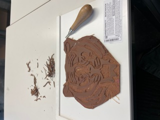
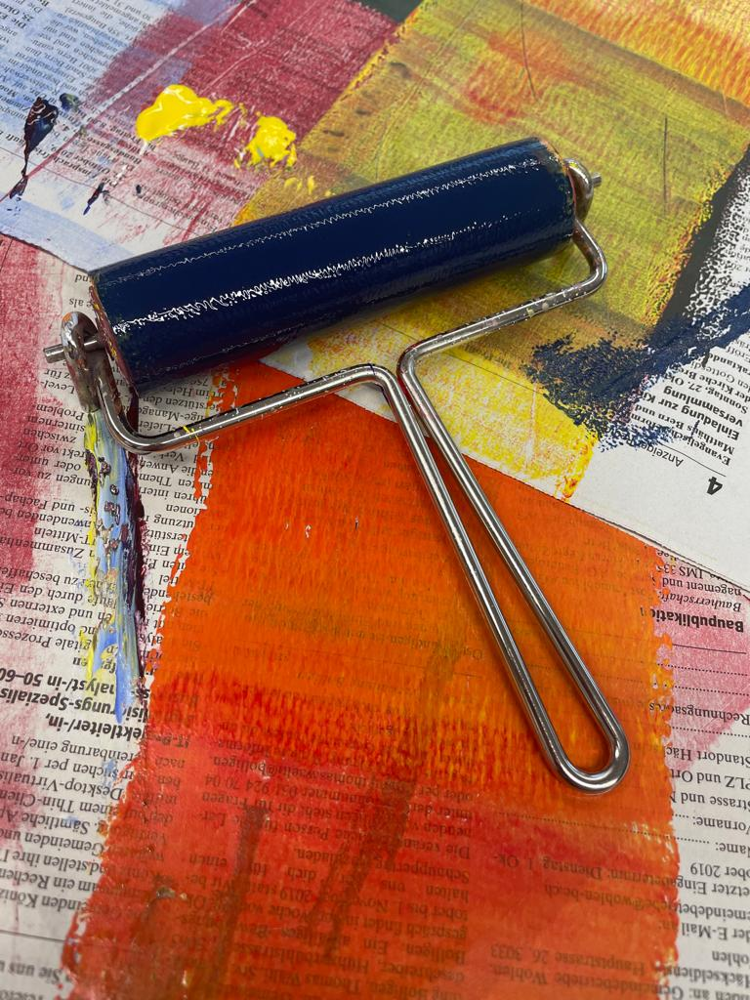
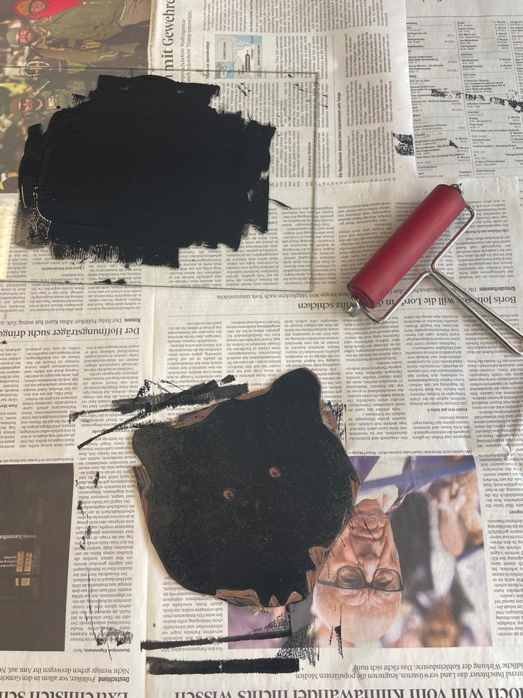
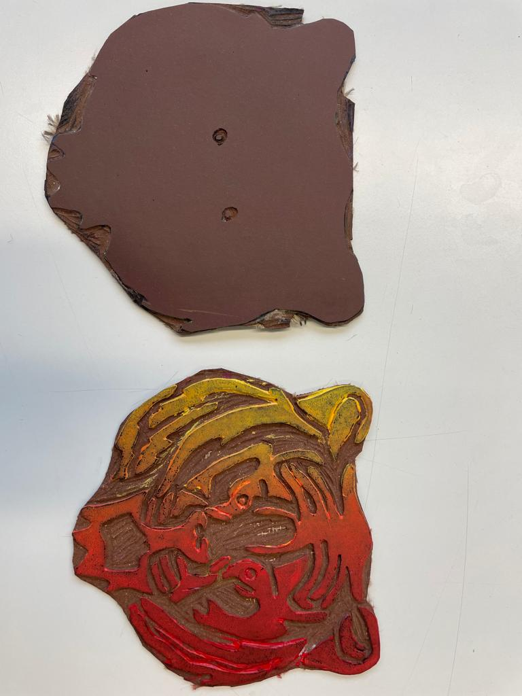
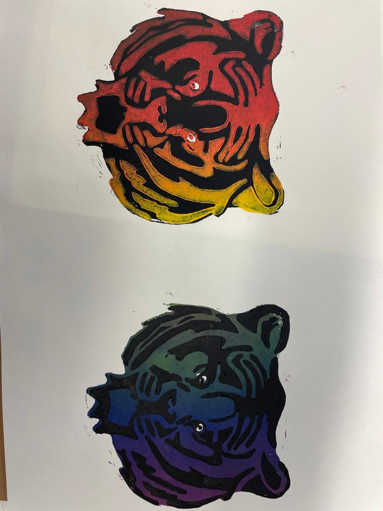

+++
title = "Linolschnitt Anleitung"
date = "2021-05-26"
draft = false
pinned = false
description = "Der Linolschnitt ist eine tolle Möglichkeit, um mit wenig Mitteln wunderschöne Postkarten, Kunstdrucke oder Wandbilder zu drucken. \nDamit kannst du deiner Fantasie freien Lauf lassen. \n"
+++
## `Aus der Linolplatte erstellst du ganz einfach mit dem Schnittmaterial eine "Schablone" mit der du dann auf Papier, Karton und auch andere Materialien drucken kannst.`

## `Das brauchst du für den Linolschnitt:`

* eine **Linolplatte**
* **Schnittset**
* (**Holzplatte**) hilft beim Schnitt

## `Für das Drucken brauchst du:`

* **Walze**
* **Farbplatte** zum Farben mischen
* **Druckfarbe**
* **Papier**

# `Linolschnitt`

1. Überlege dir was du als **Motiv**
2. Übertrage es auf die **Linolplatte**

   **`Wichtig:`** 

   `Das ist vor allem bei Buchstaben und Zahlen wichtig.`

   ##### `Dafür kannst du einen`**`Bleistift oder weissen Farbstift brauchen`**
3. Fange mit dem Schneiden an

   `Achte darauf das du dir nicht in die Finger schneidest`

   ## `Und zufrieden mit deinem Motiv?`

   

   ## `also kommst du jetzt zum`**`Drucken.`**

## **`Drucken:`**

1. Mische dir deine gewünschten Farben auf der Farbpalette
2. Nimm die Farbe mit der Walze auf

   `Beachte das Genug Farbe auf der Walze ist`

   
3. Bemale deine Linolplatte mit der Walze

   `Du kannst auch Farbverläufe kreieren`

   

   
4. Nachdem du die Platte bemalt hast, überträgst du die Farbige Seite an das Blatt

   Beachte das du gut drückst und auch ein Löffel gebrauchst für eine saubere Übertragung.

   

   ## `So jetzt hast du die Basics und kannst dich austoben und mehrere Platten erstellen!`

# **Viel Spass :)**