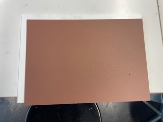
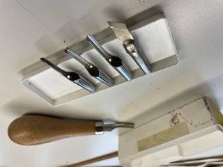
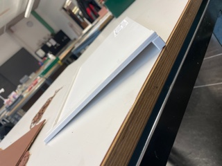

+++
title = "Linolschnitt Anleitung"
date = "2021-03-03"
draft = true
pinned = false
description = "Der Linolschnitt ist eine tolle Möglichkeit, um mit wenig Mitteln wunderschöne Postkarten, Kunstdrucke oder Wandbilder zu drucken. \nDamit kannst du deiner Fantasie freien Lauf lassen. \nAus der Linolplatte erstellst du ganz einfach mit dem Schnittmaterial eine \"Schablone\" mit der du dann auf Papier, Karton und auch andere Materialien drucken kannst"
+++
# Für den Linolschnitt brauchst du:

*  eine **Linolplatte**
*  **Schnittset**
*  (**Holzplatte**) hilft beim Schnitt

