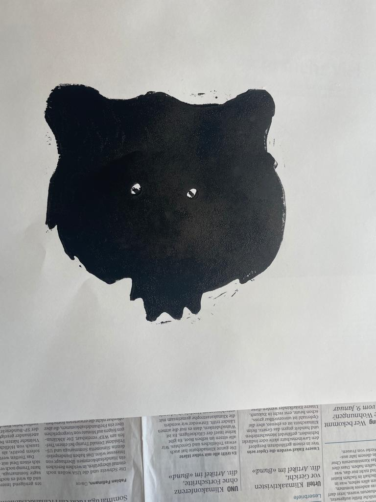

+++
title = "Linolschnitt Anleitung"
date = "2021-03-03"
draft = true
pinned = false
description = "Der Linolschnitt ist eine tolle Möglichkeit, um mit wenig Mitteln wunderschöne Postkarten, Kunstdrucke oder Wandbilder zu drucken. \nDamit kannst du deiner Fantasie freien Lauf lassen. \nAus der Linolplatte erstellst du ganz einfach mit dem Schnittmaterial eine \"Schablone\" mit der du dann auf Papier, Karton und auch andere Materialien drucken kannst"
+++
# Material

## Für den Linolschnitt:

* eine **Linolplatte**
* **Schnittset**
* (**Holzplatte**) hilft beim Schnitt

## Für das Drucken brauchst du:

* **Walze**
* **Farbplatte** zum Farben mischen
* **Druckfarbe**
* **Papier**

# Linolschnitt

1. Überlege dir was du als Motiv haben willst
2. Übertrage es auf die Linolplatte

   > **Wichtig**: trage dein Motiv spiegelverkehrt auf die Platte. Das ist vor allem bei Buchstaben und Zahlen wichtig.
   >
   > Dafür kannst du einen Bleistift oder eine weisse Farbe brauchen
3. Fange mit dem Schneiden an 

   > Achte darauf das du dir nicht in die Finger schneidest

   

   Und zufrieden mit deinem Motiv?

   

   also kommst du jetzt zum **Drucken.**

   # **Drucken**

   1. Mische dir deine gewünschten Farben auf der Farbpalette
   2. Nimm die Farbe mit der Walze auf

      > Beachte das Genug Farbe auf der Walze ist
      >
      > 
   3. Bemale deine Linolplatte mit der Walze

      Du kannst auch Farbverläufe kreieren

      

      
   4. Nachdem du die Platte bemalt hast, überträgst du die Farbige Seite an das Blatt

      Beachte das du gut drückst und auch ein Löffel gebrauchst für eine saubere Übertragung

      

      

   5. So jetzt hast du die Basics und kannst dich austoben und mehrere Platten erstellen!

   ## **Viel Spass :)**